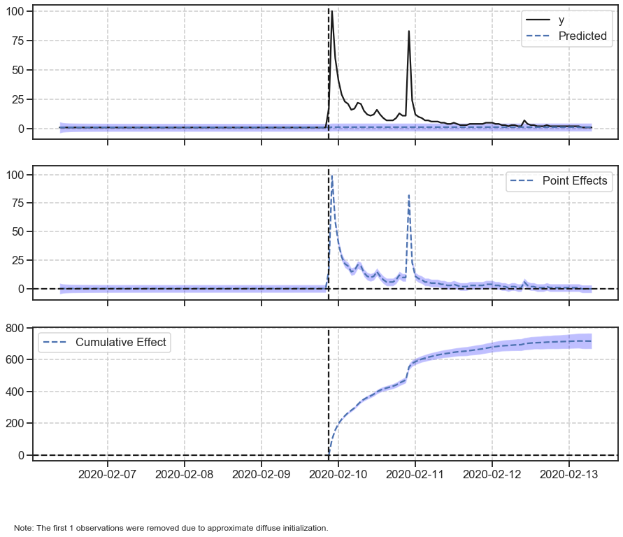

# Causal Impact: state-space models in settings where a randomized experiment is unavailable



**TL;DR**: There are ways of measuring the causal impact of some business intervention even in scenarios where a randomized experiment is unavailable. In this post we investigated the increase in Google trends popularity index of a search term caused by a mention of this unusual term on a popular brazilian TV Show. The same logic can be applied in business contexts such as the impact of a new product launch, the onset of an advertising campaign and other problems in economics, epidemiology, biology among others.

## Motivation

At work, you are responsible of taking many decisions that can impact several aspects of the business in different ways. Most of the time there are simple approaches of measuring the impact of those decisions. 

You launched an advertising campaign and analyzing the sales that are up 5% one month later you conclude your campaign was a success. Right? Well, did you run a randomized experiment? Did you account for other factors such as seasonality or trend of the sales? 

Similar to that scenario, there are a pletora of other cases where we may be interested in measuring the causal impact of one's action.

## Causal Impact by Google

There are some complex aspects of infering the causality of an intervention. But, not everything is lost, in 2015 some awesome employees from Google, published a paper entitled: "INFERRING CAUSAL IMPACT USING BAYESIAN STRUCTURAL TIME-SERIES MODELS".

Along with the paper they also introduced CausalImpact, a R package (there is also a Python port by Dafiti) that implements their approach. 

Quoting directly from the abstract of the paper:
> This paper proposes to infer causal impact on the basis of a diffusion-regression state-space model that **predicts the counterfactual market response in a synthetic control that would have occurred had no intervention taken place**. In contrast to classical difference-in-differences schemes, state-space models make it possible to (i) infer the temporal evolution of attributable impact, (ii) incorporate empirical priors on the parameters in a fully Bayesian treatment, and (iii) flexibly accommodate multiple sources of variation, including local trends, seasonality and the time-varying influence of contemporaneous covariates

## Measuring the causal impact of mentioning an unusual term on a popular brazilian TV show

## 1. Gathering the data

We are going to download the data from Google Trends. 

There are two main ways of doing this:
- We can navigate to the [website](https://trends.google.com/trends/?geo=BR) and specify which term we are looking for, the region and timeframe
- We can do this directly in Python, using a third-party library such as [pytrends](https://github.com/GeneralMills/pytrends)

From the causal impact presentation, the author of the package suggests that we use between 5 to 10 related time series that can help model the behaviour of our time series of interest.

Therefore, we are going to download several common brazilian terms at the same time frames that may help our bayesian structural time series model in understanding the behaviour of the searches of our target term.

```python
# pytrends code to save our queries
```

## 2. Organizing the data

```python
# pandas code to aggregate the data in a single dataframe
```

## 3. Causal Impact

```python
# causal impact code
```

## Final thoughts

