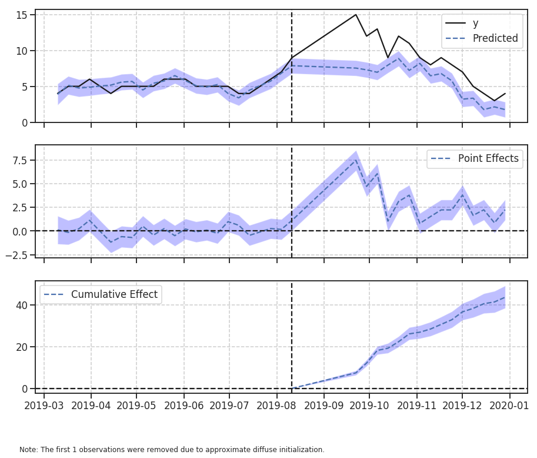
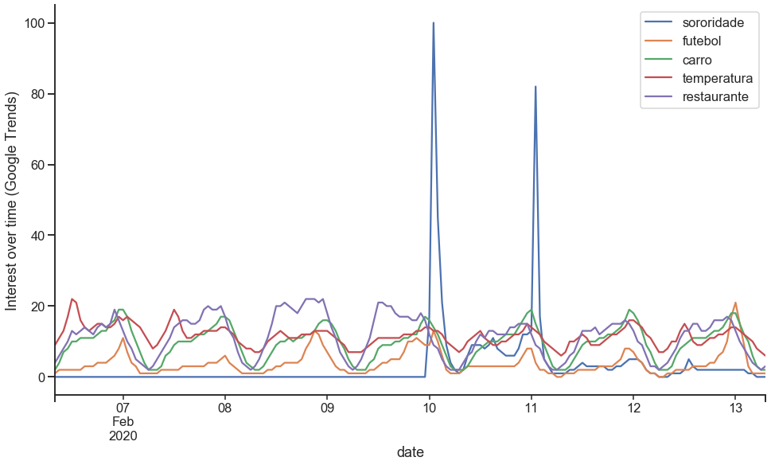
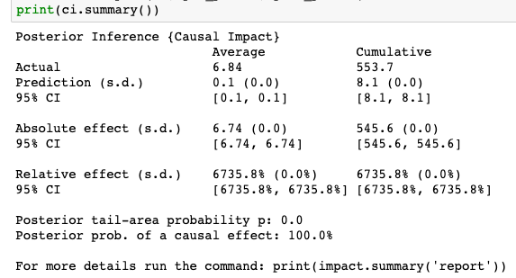
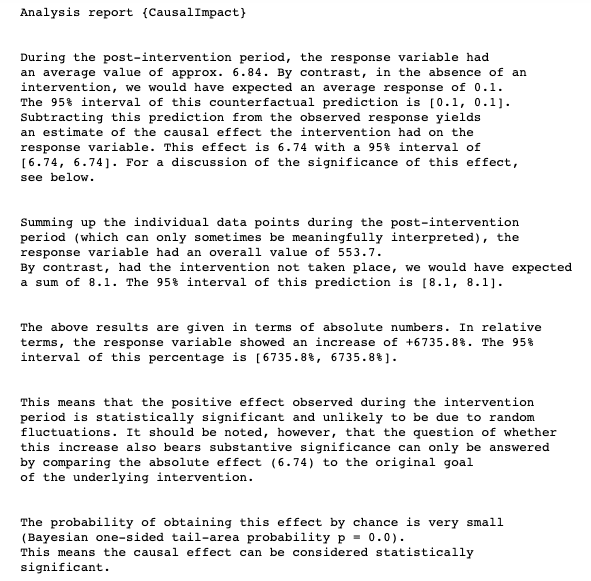
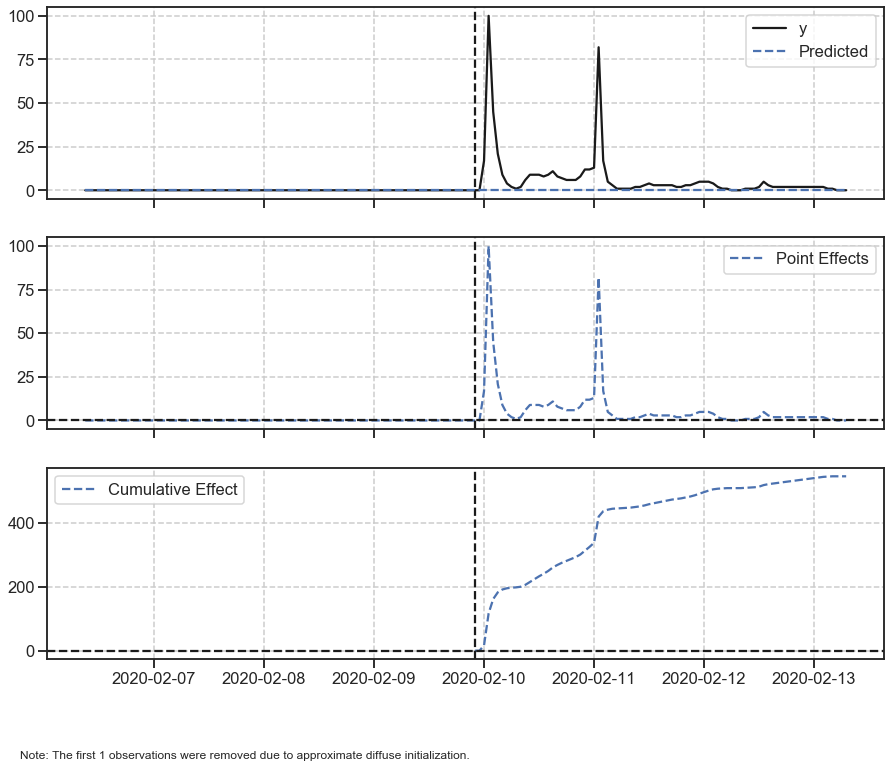
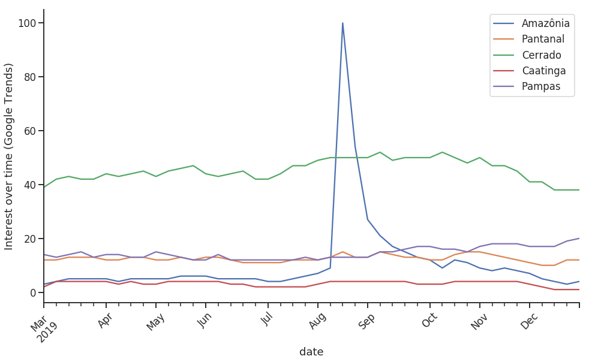
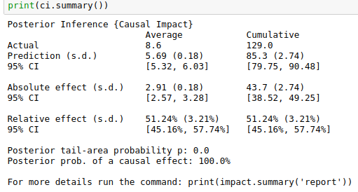
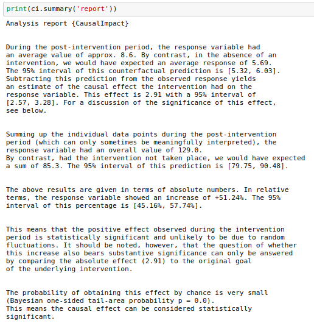

# Causal Impact: state-space models in settings where a randomized experiment is unavailable



**TL;DR**: There are ways of measuring the causal impact of some business intervention even in scenarios where a randomized experiment is unavailable. In this post we investigated the increase in Google trends popularity index of some search terms caused by different interventions. The same logic can be applied in business contexts such as the impact of a new product launch, the onset of an advertising campaign and other problems in economics, epidemiology, biology among others.

## Motivation

At work, you are responsible of taking many decisions that can impact several aspects of the business in different ways. Most of the time there are simple approaches of measuring the impact of those decisions. 

You launched an advertising campaign and analyzing the sales that are up 5% one month later you conclude your campaign was a success. Right? Well, did you run a randomized experiment? Did you account for other factors such as seasonality or trend of the sales? 

Similar to that scenario, there are a pletora of other cases where we may be interested in measuring the causal impact of one's action.

## Causal Impact by Google

There are some complex aspects of infering the causality of an intervention. In 2015 some awesome employees from Google, published a paper entitled: "*INFERRING CAUSAL IMPACT USING BAYESIAN STRUCTURAL TIME-SERIES MODELS*".

Along with the paper they also introduced [CausalImpact](https://google.github.io/CausalImpact/CausalImpact.html), an R package (there is also a [Python port by Dafiti](https://github.com/dafiti/causalimpact)) that implements their approach. In this tutorial we are going to use the Python version.

Quoting directly from the abstract of the paper:
> This paper proposes to infer causal impact on the basis of a diffusion-regression state-space model that **predicts the counterfactual market response in a synthetic control that would have occurred had no intervention taken place**. In contrast to classical difference-in-differences schemes, state-space models make it possible to (i) infer the temporal evolution of attributable impact, (ii) incorporate empirical priors on the parameters in a fully Bayesian treatment, and (iii) flexibly accommodate multiple sources of variation, including local trends, seasonality and the time-varying influence of contemporaneous covariates

## Measuring the causal impact of mentioning an unusual term on a popular brazilian TV show

## Context
Big Brother Brasil (BBB) is a popular brazilian TV show that is broadcasted in open television at prime time. One of the participants has incentivized live the search for an uncommon word: "Sororidade" ("sorority")
https://www.uol.com.br/universa/noticias/redacao/2020/02/11/sororidade-buscas-no-google-crescem-250-apos-fala-de-manu-gavassi-no-bbb.htm

## 1. Gathering the data

We are going to download the data from Google Trends. 

There are two main ways of doing this:
- We can navigate to the [website](https://trends.google.com/trends/?geo=BR) and specify which term we are looking for, the region and timeframe
- We can do this directly in Python, using a third-party library such as [pytrends](https://github.com/GeneralMills/pytrends)

To install `pytrends`, switch to your preferred environment and run the command:
```bash
pip install pytrends
```

From the causal impact presentation, the author of the package suggests that we use between 5 to 10 related time series that can help model the behaviour of our time series of interest.

Therefore, we are going to download several common brazilian terms at the same time frames that may help our bayesian structural time series model in understanding the behaviour of the searches of our target term.

```python
from pytrends.request import TrendReq

pytrends = TrendReq(hl='pt-BR', tz=45)

kw_list = ["sororidade", "futebol", "carro", "temperatura", "restaurante"]
pytrends.build_payload(kw_list, cat=0, timeframe="2020-02-06T08 2020-02-13T07")

# the interest_over_time() method returns a pandas DataFrame
df = pytrends.interest_over_time()
```

| date                | sororidade | futebol | carro | temperatura | restaurante | isPartial |
| :------------------ | ---------: | ------: | ----: | ----------: | ----------: | :-------- |
| 2020-02-06 08:00:00 |          0 |       1 |     2 |           9 |           4 | False     |
| 2020-02-06 09:00:00 |          0 |       2 |     4 |          11 |           6 | False     |
| 2020-02-06 10:00:00 |          0 |       2 |     7 |          13 |           8 | False     |
| 2020-02-06 11:00:00 |          0 |       2 |     8 |          17 |          10 | False     |
| 2020-02-06 12:00:00 |          0 |       2 |    10 |          22 |          13 | False     |

## 2. Organizing the data

```python
df = df.drop(columns=["isPartial"])

df.plot(figsize=[16,9])
sns.despine()
plt.ylabel("Interest over time (Google Trends)")
plt.xticks(rotation=45)
```



```python
# changing the zeroes to 0.1 so the model converge
df["sororidade"] = df["sororidade"].apply(lambda x: 0.1 if x==0 else x)
```

## 3. Causal Impact

```python
pre_period = [
    pd.to_datetime(np.min(df.index.values)),
    pd.to_datetime(np.datetime64("2020-02-09T22:00:00.000000000")),
]
post_period = [
    pd.to_datetime(np.datetime64("2020-02-09T23:00:00.000000000")),
    pd.to_datetime(np.max(df.index.values)),
]

ci = CausalImpact(df, pre_period, post_period)
print(ci.summary())
```



```python
print(ci.summary(output='report'))
```



```python
ci.plot()
```



Just by looking at the sorority interest over time plot we may have concluded that it was obvious the causal effect. So, let's look at another example to consolidate our understanding.

## Another example - Amazon rainforest burns
```python
kw_list = ["Amazônia", "Pantanal", "Cerrado", "Caatinga", "Pampas"]
pytrends.build_payload(kw_list, cat=0, timeframe='2019-03-01 2020-01-01')

df = pytrends.interest_over_time()
```

| date                |   Amazônia |   Pantanal |   Cerrado |   Caatinga |   Pampas | isPartial   |
|:--------------------|-----------:|-----------:|----------:|-----------:|---------:|:------------|
| 2019-03-03 00:00:00 |          3 |         12 |        39 |          2 |       14 | False       |
| 2019-03-10 00:00:00 |          4 |         12 |        42 |          4 |       13 | False       |
| 2019-03-17 00:00:00 |          5 |         13 |        43 |          4 |       14 | False       |
| 2019-03-24 00:00:00 |          5 |         13 |        42 |          4 |       15 | False       |
| 2019-03-31 00:00:00 |          5 |         13 |        42 |          4 |       13 | False       |



```python
df = df.drop(columns=["isPartial"])

pre_period = [
    pd.to_datetime(np.min(df.index.values)),
    pd.to_datetime(np.datetime64("2019-08-11")),
]
post_period = [
    pd.to_datetime(np.datetime64("2019-09-22")),
    pd.to_datetime(np.max(df.index.values)),
]

ci = CausalImpact(df, pre_period, post_period)
print(ci.summary())
```



```python
print(ci.summary(output='report'))
```



```python
ci.plot()
```


## Final thoughts

The examples shown here help illustrate the concept and the package's API.

I encourage you to go beyond and try to come up with business scenarios where these kind of reports can be useful. At work, I had no problem finding these scenarios and it is your duty as a Data Scientist to provide value guided by data where you judge fit.